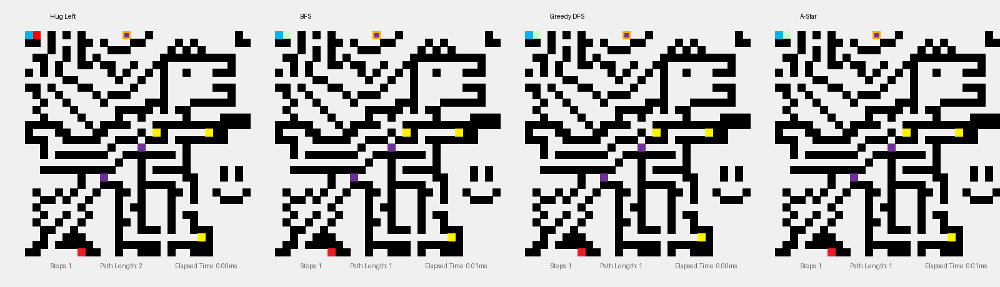

# Maze Encoder and Solver
## Setup
> Moved to SETUP.md
## Maze Encoder
Maze Encoder takes in a 30x30 pixel picture and makes a .bin file that reconstructs the maze using a custom 32-bit instruction set.
### Custom Instruction Set

> This instruction set is formatted in Big-Endian style for ease of debugging. Actual hardware implementation would probably benefit from Little-Endian.

> The main motivation for packaging the instructions in such a way is to make it compressed and serialised. Possible applications would include transmitting this file over UART to a small microcontroller, or converting to a .mem file to initialise a ROM within a SoC. This instruction set compresses the map into around 200 bytes, as compared to the 900 bytes default output from MazeMate, which matters in hardware resource constrained systems.

> Current limitations include only being able to process 30x30 or smaller mazes.

#### OPCODE
1) 0x1 Represents the Build Wall instruction.
2) 0x2 Represents the Place Entity instruction.
#### Build Wall
1) DATA represents the walls within half a row, with 1 representing a filled wall.
2) ROW HALF represents the left (0x0) or right (0xF) half of each row.
3) ROW NUMBER represents the row number.
4) OPCODE fixed as 0x1 for Build Wall instructions.
#### Place Entity
1) ROW NUMBER represents the row number.
2) COLUMN NUMBER represents the column number.
3) FUNCT1 represents the type of entity (1-hot encoding):
```python
SPEP_FUNCT1 = 0x1       #Start/End Points
HEART_FUNCT1 = 0x2      #Hearts
GEM_FUNCT1 = 0x4        #Gems
MONSTER_FUNCT1 = 0x8    #Monsters
```
4) FUNCT2 represents the entity modifier:
```python
#When FUNCT1 is Start/End Points
SP_FUNCT2 = 0x1     #Start Point
EP_FUNCT2 = 0x2     #End Point

#When FUNCT1 is Hearts, FUNCT2 is HP
#Will not implement. All hearts treated as 200hp.

#When FUNCT1 is Gems
DEF_FUNCT2 = 0x0    #Null

#When FUNCT1 is Monsters, FUNCT2 is Monster Type.
#Will not implement. All monsters treated the same.
```
5) FUNCT3 represents the entity orientation (1-hot encoding):
```python
NORTH = 0x1
EAST = 0x2
SOUTH = 0x4
WEST = 0x8
```

## Maze Solver
### Results (Single Task)

> Each frame aligns a new node found for each of the 3 methods. However, this is just a visual representation as the frame period for each method is different. Refer to elapsed time in the bottom right for a more accurate comparision of efficiency.

We see that for small maps, a simple bruteforce algorithm like BFS actually beats A-Star. Even though more tiles were explored over more cycles, BFS has less logic overhead which resulted in faster elapsed time when compared to A-Star. Looking at the dinosour head, we also observe that the path taken by BFS tends to spread more radially, while DFS and A-Star tends to take a more perpendicular route. This is due to DFS and A-Star using manhatten distance as the main heuristic, which does not optimize for diagonal movements.

### Results (Multi Task)


| Criteria | Hug Left | BFS | Greedy DFS | A-Star |
| --- | --- | --- | --- | --- |
| Steps | 358 | 948 | 674 | 626 |
| Avg. Time per Step (us) | 2.35 | 3.13 | 3.53 | 3.72 | 
| Total Elapsed Time (ms) | 0.84 | 2.97 | 2.38 | 2.33 |
| Path Length | 357 | 231 | 233 | 231

With multi-task, we see that the heuristics overhead of Greedy DFS and A-Star starts to become worth it, beating BFS with similar path lengths. As expected, average time per step also increases as our algorithm complexity increases. (Further optimizations can be made to reduce iterations and branch mispredictions, but will not be explored in this project)

Hug left was also introduced for fun. However, this algorithm is highly unpractical, and only really works out because of the specific maze design. The benefits of hug left would be its ease of implementaiton and lack of complexity, making it suitable for super small mazes with no sensory inputs (User acts blindly).

### Maze Decoder
* Utilizes the custom 32-bit .bin instruction file to reconstruct the maze.
* Usage of match case and bit masking mimics how a hardware would multiplex (like match case) and sample specific parts of the instruction (bit masking). This style mimics SystemVerilog idealogy.
```python
def _parse_bin(self):
        with open(self.bin_path, "rb") as f:
            data = f.read()
            count = len(data) // 4
            instructions = struct.unpack(f'>{count}I', data)

        for instr in instructions:
            opcode = instr & 0xF
            match opcode:
                case 0x1:
                    y = (instr >> 4) & 0xFF
                    half = (instr >> 12) & 0xF
                    wall_data = (instr >> 16) & 0x7FFF
                    
                    for i in range(15):
                        if wall_data & (1 << (14 - i)):
                            x = i if half == 0 else i + 15
                            if 0 <= x < 30 and 0 <= y < 30:
                                self.grid[y][x] = 1
                case 0x2:
                    y = (instr >> 24) & 0xFF
                    x = (instr >> 16) & 0xFF
                    funct1 = (instr >> 12) & 0xF
                    funct2 = (instr >> 8) & 0xF
                    match funct1:
                        case 0x1:
                            match funct2:
                                case 0x1:
                                    self.start_pos = (x, y)
                                case 0x2:
                                    self.end_pos = (x, y)
                        case 0x2:
                            self.entities['hearts'].append((x,y))
                        case 0x4:
                            self.entities['gems'].append((x,y))
                        case 0x8:
                            self.entities['monsters'].append((x,y))
```

### Path Selector for Multi-Task Algorithm
#### Method
* The path selector assumes a starting health of 6 (600hp), with each monster encounter requiring 100hp.
* It pre-calculates the total number of monsters and available hearts, only queuing the required number of hearts for the whole map.
* Orders all gems, monsters and required hearts by Manhatten Distance before appending the end point as the last path.
#### Algorithm
```python
def _get_path(self):
        current_hp = 6
        current_pos = self.start_pos
        self.goal_path = []
        objectives = self.entities['gems'][:] + self.entities['monsters'][:]
        hearts_available = self.entities['hearts'][:]

        while objectives:
            objectives.sort(key=lambda p: abs(p[0] - current_pos[0]) + abs(p[1] - current_pos[1]))
            target = objectives[0]

            if target in self.entities['monsters'] and current_hp <= 1:
                hearts_available.sort(key=lambda p: abs(p[0] - current_pos[0]) + abs(p[1] - current_pos[1]))
                heart_target = hearts_available.pop(0)
                self.goal_path.append(heart_target)
                current_pos = heart_target
                current_hp += 2
            
            target = objectives.pop(0)
            self.goal_path.append(target)
            current_pos = target
            
            if target in self.entities['monsters']:
                current_hp -= 1
        
        self.goal_path.append(self.end_pos)
```

### Breadth First Search (BFS)
#### FIFO Queue
* Utilizes First-In-First-Out queue to track next node.
* With each cycle, adds neighbouring nodes to the queue.
#### Algorithm
```python
if not bfs[4]:
                bfs[6] += 1
                t0 = time.time()
                if bfs[3]:
                    (cx, cy), path = bfs[3].popleft()
                    
                    for i in range(bfs[0], len(self.goal_path)):
                        if (cx, cy) == self.goal_path[i]:
                            bfs[0] = i + 1
                            bfs[1] = path
                            if bfs[0] >= len(self.goal_path): 
                                bfs[4] = True
                            else:
                                bfs[3] = deque([( (cx, cy), path )])
                                bfs[2] = {(cx, cy)}
                            break
                    
                    if not bfs[4]:
                        for dx, dy in [(0, 1), (1, 0), (0, -1), (-1, 0)]:
                            nx, ny = cx + dx, cy + dy
                            if 0 <= nx < 30 and 0 <= ny < 30 and self.grid[ny][nx] == 0 and (nx, ny) not in bfs[2]:
                                bfs[2].add((nx, ny))
                                bfs[3].append(((nx, ny), path + [(nx, ny)]))
```
### Greedy DFS
#### FILO Queue
* Utilizes First-In-Last-Out queue to track next node.
* With each cycle, adds neighbouring nodes to the queue.
* Prioritise neighbour nodes with lowest manhatten distance (Greedy).
* For small maps, the greedy system might actually make algo slower due to extra overhead with every step.
#### Algorithm
```python
if not dfs[4]:
                dfs[6] += 1
                t0 = time.time()
                if dfs[3]:
                    (cx, cy), path = dfs[3].pop()
                    for i in range(dfs[0], len(self.goal_path)):
                        if (cx, cy) == self.goal_path[i]:
                            dfs[0] = i + 1
                            dfs[1] = path
                            if dfs[0] >= len(self.goal_path): dfs[4] = True
                            else:
                                dfs[3] = deque([( (cx, cy), path )])
                                dfs[2] = {(cx, cy)}
                            break
                    if not dfs[4]:
                        neighbors = []
                        target = self.goal_path[dfs[0]]
                        for dx, dy in [(0, 1), (1, 0), (0, -1), (-1, 0)]:
                            nx, ny = cx + dx, cy + dy
                            if 0 <= nx < 30 and 0 <= ny < 30 and self.grid[ny][nx] == 0 and (nx, ny) not in dfs[2]:
                                neighbors.append((nx, ny))
                        neighbors.sort(key=lambda p: abs(p[0]-target[0]) + abs(p[1]-target[1]), reverse=True)
                        for n in neighbors:
                            dfs[2].add(n); dfs[3].append((n, path + [n]))
                dfs[5] += time.time() - t0
```
### A-Star
#### F-Score
* Total cost (F-Score) = Path cost (G-Score) + Heuristic (H-Score).
* Heuristic given by the Manhatten Distance from current location to end point.
#### Algorithm
```python
if not astar[4]:
                astar[6] += 1
                t0 = time.time()
                if astar[3]:
                    f, (cx, cy), path = heapq.heappop(astar[3])
                    for i in range(astar[0], len(self.goal_path)):
                        if (cx, cy) == self.goal_path[i]:
                            astar[0] = i + 1
                            astar[1] = path
                            if astar[0] >= len(self.goal_path): astar[4] = True
                            else:
                                target = self.goal_path[astar[0]]
                                astar[2] = {(cx, cy): 0}
                                h = abs(target[0]-cx) + abs(target[1]-cy)
                                astar[3] = [(h, (cx, cy), path)]
                            break
                    if not astar[4]:
                        target = self.goal_path[astar[0]]
                        for dx, dy in [(0, 1), (1, 0), (0, -1), (-1, 0)]:
                            nx, ny = cx+dx, cy+dy
                            if 0 <= nx < 30 and 0 <= ny < 30 and self.grid[ny][nx] == 0:
                                new_g = astar[2][(cx, cy)] + 1
                                if (nx, ny) not in astar[2] or new_g < astar[2][(nx, ny)]:
                                    astar[2][(nx, ny)] = new_g
                                    h = abs(target[0]-nx) + abs(target[1]-ny)
                                    heapq.heappush(astar[3], (new_g+h, (nx, ny), path+[(nx, ny)]))
                astar[5] += time.time() - t0
```

## Helper Functions

### Maze Encoder
> Responsible for creating the .bin instruction file.
#### Instruction Generation Logic
> Based on the instructions shown above
```Python
def _gen_wall(self, x, y):
        if self.img.getpixel((x,y)) == (0, 0, 0):
            if x > 14:
                self.data_right |= (1 << (14 - (x - 15)))
            else:
                self.data_left |= (1 << (14-x))

def _gen_entity(self, x, y):
    instr = 0
    match self.img.getpixel((x,y)):
        case self.STARTPOINT:
            instr = (
                (y << 24) 
                | (x << 16) 
                | (self.SPEP_FUNCT1 << 12) 
                | (self.SP_FUNCT2 << 8) 
                | (self.NORTH << 4) 
                | self.PLACE_ENT
            )
        case self.ENDPOINT:
            instr = (
                (y << 24) 
                | (x << 16) 
                | (self.SPEP_FUNCT1 << 12) 
                | (self.EP_FUNCT2 << 8) 
                | (self.NORTH << 4) 
                | self.PLACE_ENT
            )
        case self.HEART:
            instr = (
                (y << 24) 
                | (x << 16) 
                | (self.HEART_FUNCT1 << 12) 
                | (0x1 << 8) 
                | (self.NORTH << 4) 
                | self.PLACE_ENT
            )
        case self.GEM:
            instr = (
                (y << 24) 
                | (x << 16) 
                | (self.GEM_FUNCT1 << 12) 
                | (0x1 << 8) 
                | (self.NORTH << 4) 
                | self.PLACE_ENT
            )
        case self.MONSTER:
            orientation = self.NORTH
            direction = [
                ((0, -1), self.NORTH),
                ((1, 0),  self.EAST),
                ((0, 1),  self.SOUTH),
                ((-1, 0), self.WEST)
            ]

            for (dx, dy), ori in direction:
                nx, ny = x + dx, y + dy
                if self.img.getpixel((nx,ny)) == self.MONSTER_FACING:
                    orientation = ori
            
            instr = (
                (y << 24) 
                | (x << 16) 
                | (self.MONSTER_FUNCT1 << 12) 
                | (0x1 << 8) 
                | (orientation << 4) 
                | self.PLACE_ENT
            )
```

#### Bitstream Encoder
> Writes the generated instructions into a .bin file.
```Python
def generate_bitstream(self, path=BITSTREAM_PATH):
        self.bin_path = os.path.join(self.script_dir, path)
        for y in range(30):
            self.data_left = 0
            self.data_right = 0
            for x in range(30):
                self._gen_wall(x, y)
                self._gen_entity(x, y)
            instr_1 = ((self.data_left) << 16) | (0x0 << 12) | (y << 4) | self.BUILD_WALL
            instr_2 = ((self.data_right) << 16) | (0xF << 12) | (y << 4) | self.BUILD_WALL
            self.bitstream.append(instr_1)
            self.bitstream.append(instr_2)
        binary_data = struct.pack(f'>{len(self.bitstream)}I', *self.bitstream)
        with open(self.bin_path, "wb") as f:
            f.write(binary_data)
```

### Image Generation
Draws the map. Not much to explain here.
```python
def _draw_submaze(self, draw, offset_x, offset_y, scale, visited, path, title, step_text, time, goal_idx):

        entity_colors = {
            'hearts': (34, 177, 80),
            'gems': (255, 242, 0),
            'monsters': (111, 49, 152)
        }

        draw.text((offset_x + 40, offset_y - 30), title, fill=(0,0,0))
        draw.text((offset_x + 40, offset_y + (30*scale) + 10), f"Steps: {step_text}", fill=(100,100,100))
        draw.text((offset_x + 120, offset_y + (30*scale) + 10), f"Path Length: {len(path)}", fill=(100,100,100))
        draw.text((offset_x + 240, offset_y + (30*scale) + 10), f"Elapsed Time: {time*1000:.2f}ms", fill=(100,100,100))
        
        for y in range(30):
            for x in range(30):
                rect = [offset_x + x*scale, offset_y + y*scale, offset_x + (x+1)*scale, offset_y + (y+1)*scale]
                if self.grid[y][x] == 1: draw.rectangle(rect, fill=(0,0,0))
                elif (x, y) in visited: draw.rectangle(rect, fill=(200, 255, 200))
        
        for key, color in entity_colors.items():
            for (ex, ey) in self.entities[key]:
                rect = [offset_x + ex*scale, offset_y + ey*scale, offset_x + (ex+1)*scale, offset_y + (ey+1)*scale]
                draw.rectangle(rect, fill=color)
        
        for x, y in path:
            rect = [offset_x + x*scale, offset_y + y*scale, offset_x + (x+1)*scale, offset_y + (y+1)*scale]
            draw.rectangle(rect, fill=(255, 0, 0))

        for pos, color in [(self.start_pos, (0, 183, 239)), (self.end_pos, (237, 28, 36))]:
            if pos:
                x, y = pos
                draw.rectangle([offset_x + x*scale, offset_y + y*scale, offset_x + (x+1)*scale, offset_y + (y+1)*scale], fill=color)
        
        if goal_idx < len(self.goal_path):
            tx, ty = self.goal_path[goal_idx]
            rect = [offset_x + tx*scale, offset_y + ty*scale, offset_x + (tx+1)*scale, offset_y + (ty+1)*scale]
            draw.rectangle(rect, outline=(255, 165, 0), width=3)
```
