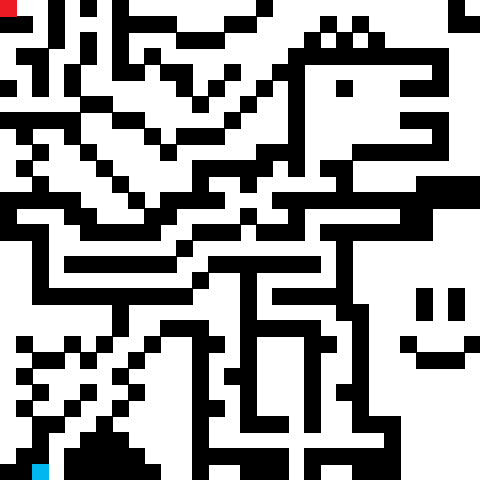

# Maze Solver by Yeo Shu Yi
## Maze Encoder
Maze Encoder takes in a 30x30 pixel picture and makes a .bin file that reconstructs the maze using a custom 32-bit instruction set.
### Custom Instruction Set

> This instruction set is formatted in Big-Endian style for ease of debugging. Actual hardware implementation would probably benefit from Little-Endian.
#### OPCODE
1) 0x1 Represents the Build Wall instruction.
2) 0x2 Represents the Place Entity instruction.
#### Build Wall
1) DATA represents the walls within half a row, with 1 representing a filled wall.
2) ROW HALF represents the left (Ox0) or right (0xF) half of each row.
3) ROW NUMBER represents the row number.
4) OPCODE fixed as 0x1 for Build Wall instructions.
#### Place Entity
1) ROW NUMBER represents the row number.
2) COLUMN NUMBER represents the column number.
3) FUNCT1 represents the type of entity (1-hot encoding):
```python
SPEP_FUNCT1 = 0x1       #Start/End Points
HEART_FUNCT1 = 0x2      #Hearts
GEM_FUNCT1 = 0x4        #Gems
MONSTER_FUNCT1 = 0x8    #Monsters
```
4) FUNCT2 represents the entity modifier:
```python
#When FUNCT1 is Start/End Points
SP_FUNCT2 = 0x1     #Start Point
EP_FUNCT2 = 0x2     #End Point

#When FUNCT1 is Hearts, FUNCT2 is HP

#When FUNCT1 is Gems
DEF_FUNCT2 = 0x0    #Null

#When FUNCT1 is Monsters
#(To be considered)
```
5) FUNCT3 represents the entity orientation (1-hot encoding):
```python
NORTH = 0x1
EAST = 0x2
SOUTH = 0x4
WEST = 0x8
```
## Maze Solver
### Breadth First Search (BFS)
#### FIFO Queue
* Utilizes First-In-First-Out queue to track next cells to explore.
#### Results

### DFS
### A-Star
WIP
