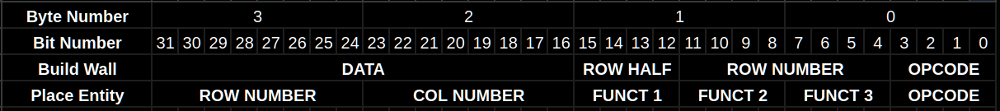
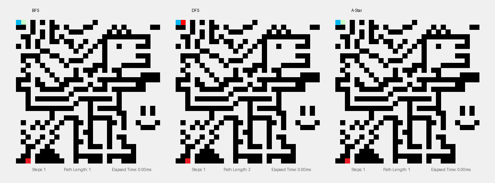

# Maze Encoder and Solver

## Current Status
> Finished simple maze with single start/end point. Working on multi-task now.

## Maze Encoder
Maze Encoder takes in a 30x30 pixel picture and makes a .bin file that reconstructs the maze using a custom 32-bit instruction set.
### Custom Instruction Set

> This instruction set is formatted in Big-Endian style for ease of debugging. Actual hardware implementation would probably benefit from Little-Endian.

> The main motivation for packaging the instructions in such a way is to make it compressed and serialised. Possible applications would include transmitting this file over UART to a small microcontroller, or converting to a .mem file to initialise a ROM within a SoC. This instruction set compresses the map into around 200 bytes, as compared to the 900 bytes default output from MazeMate, which matters in hardware resource constrained systems.

> Current limitations include only being able to process 30x30 or smaller mazes.

#### OPCODE
1) 0x1 Represents the Build Wall instruction.
2) 0x2 Represents the Place Entity instruction.
#### Build Wall
1) DATA represents the walls within half a row, with 1 representing a filled wall.
2) ROW HALF represents the left (0x0) or right (0xF) half of each row.
3) ROW NUMBER represents the row number.
4) OPCODE fixed as 0x1 for Build Wall instructions.
#### Place Entity
1) ROW NUMBER represents the row number.
2) COLUMN NUMBER represents the column number.
3) FUNCT1 represents the type of entity (1-hot encoding):
```python
SPEP_FUNCT1 = 0x1       #Start/End Points
HEART_FUNCT1 = 0x2      #Hearts
GEM_FUNCT1 = 0x4        #Gems
MONSTER_FUNCT1 = 0x8    #Monsters
```
4) FUNCT2 represents the entity modifier:
```python
#When FUNCT1 is Start/End Points
SP_FUNCT2 = 0x1     #Start Point
EP_FUNCT2 = 0x2     #End Point

#When FUNCT1 is Hearts, FUNCT2 is HP

#When FUNCT1 is Gems
DEF_FUNCT2 = 0x0    #Null

#When FUNCT1 is Monsters
#(To be considered)
```
5) FUNCT3 represents the entity orientation (1-hot encoding):
```python
NORTH = 0x1
EAST = 0x2
SOUTH = 0x4
WEST = 0x8
```
## Maze Solver
### Results

> Each frame aligns a new node found for each of the 3 methods. However, this is just a visual representation as the frame period for each method is different. Refer to elapsed time in the bottom right for a more accurate comparision of efficiency.

| Criteria | BFS | DFS | A-Star |
| --- | --- | --- | --- |
| Steps | 522 | 299 | 466 |
| Avg. Time per Step (us) | 2.85 | 1.84 | 3.64 |
| Total Elapsed Time (ms) | 1.49 | 0.55 | 1.70 |
| Path Length | 178 | 182 | 178

### Maze Decoder
* Utilizes the custom 32-bit .bin instruction file to reconstruct the maze.
* Usage of match case and bit masking mimics how a hardware would multiplex (like match case) and sample specific parts of the instruction (bit masking). This style mimics SystemVerilog idealogy.
```python
def _parse_bin(self):
    with open(self.bin_path, "rb") as f:
        data = f.read()
        count = len(data) // 4
        instructions = struct.unpack(f'>{count}I', data)

    for instr in instructions:
        opcode = instr & 0xF
        match opcode:
            case 0x1:
                y = (instr >> 4) & 0xFF
                half = (instr >> 12) & 0xF
                wall_data = (instr >> 16) & 0x7FFF
                
                for i in range(15):
                    if wall_data & (1 << (14 - i)):
                        x = i if half == 0 else i + 15
                        if 0 <= x < 30 and 0 <= y < 30:
                            self.grid[y][x] = 1
            case 0x2:
                y = (instr >> 24) & 0xFF
                x = (instr >> 16) & 0xFF
                funct2 = (instr >> 8) & 0xF
                match funct2:
                    case 0x1:
                        self.start_pos = (x, y)
                    case 0x2:
                        self.end_pos = (x, y)
```

### Breadth First Search (BFS)
#### FIFO Queue
* Utilizes First-In-First-Out queue to track next node.
* With each cycle, adds neighbouring nodes to the queue.
#### Algorithm
```python
if bfs_q and not bfs_done:
    curr_time = time.time()
    (curr_x, curr_y), path = bfs_q.popleft()
    bfs_path = path
    if (curr_x, curr_y) == self.end_pos: bfs_done = True
    else:
        for dx, dy in [(0, 1), (1, 0), (0, -1), (-1, 0)]:
            nx, ny = curr_x + dx, curr_y + dy
            if 0 <= nx < 30 and 0 <= ny < 30 and self.grid[ny][nx] == 0 and (nx, ny) not in bfs_visited:
                bfs_visited.add((nx, ny))
                bfs_q.append(((nx, ny), path + [(nx, ny)]))
    bfs_elapsed += time.time() - curr_time
    curr_time = time.time()
```
### DFS
#### FILO Queue
* Utilizes First-In-Last-Out queue to track next node.
* With each cycle, adds neighbouring nodes to the queue.
#### Algorithm
```python
if dfs_q and not dfs_done:
    curr_time = time.time()
    new_node = False
    while dfs_q and not new_node:
        (curr_x, curr_y), path = dfs_q.pop()

        if (curr_x, curr_y) == self.end_pos:
            dfs_path = path
            dfs_visited.add((curr_x, curr_y))
            dfs_done = True
            new_node = True
            break

        for dx, dy in [(0, 1), (1, 0), (0, -1), (-1, 0)]:
            nx, ny = curr_x + dx, curr_y + dy
            if 0 <= nx < 30 and 0 <= ny < 30 and self.grid[ny][nx] == 0:
                if (nx, ny) not in dfs_visited:
                    dfs_visited.add((nx, ny))
                    dfs_path = path + [(nx, ny)]
                    dfs_q.append(((nx, ny), dfs_path))
                    new_node = True
    dfs_elapsed += time.time() - curr_time
    curr_time = time.time()
```
### A-Star
#### F-Score
* Total cost (F-Score) = Path cost (G-Score) + Heuristic (H-Score).
* Heuristic given by the Manhatten Distance from current location to end point.
#### Algorithm
```python
if astar_q and not astar_done:
    curr_time = time.time()
    f, (curr_x, curr_y), path = heapq.heappop(astar_q)
    astar_path = path
    if (curr_x, curr_y) == self.end_pos: astar_done = True
    else:
        for dx, dy in [(0, 1), (1, 0), (0, -1), (-1, 0)]:
            nx, ny = curr_x + dx, curr_y + dy
            if 0 <= nx < 30 and 0 <= ny < 30 and self.grid[ny][nx] == 0:
                new_g = astar_visited_costs[curr_x, curr_y] + 1
                if (nx, ny) not in astar_visited_costs or new_g < astar_visited_costs[nx, ny]:
                    astar_visited_costs[(nx, ny)] = new_g
                    h = abs(self.end_pos[0] - nx) + abs(self.end_pos[1] - ny)
                    heapq.heappush(astar_q, (new_g + h, (nx, ny), path + [(nx, ny)]))
    astar_elapsed += time.time() - curr_time
    curr_time = time.time()
```